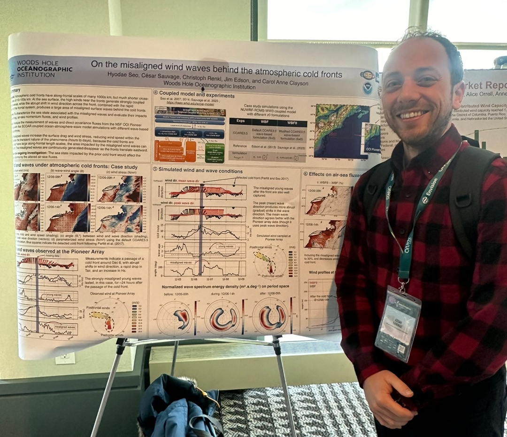

<!--
<strong>To come: ~ </strong>
<ul>
</ul>
-->

 

  <figure class="flex flex-col items-center h-full justify-end">
  <a href="nawea_102023_v2.jpg" target="_blank">
  
  <figcaption class="text-center text-sm mt-2">The North American Wind Energy Academy (NAWEA) conference in Boulder, CO, USA.</figcaption>
  </a>
  </figure>
  <figure class="flex flex-col items-center h-full justify-end">
  <a href="wave_workshop_ecmwf.jpg" target="_blank">
  
  <figcaption class="text-center text-sm mt-2">5th Workshop on waves and wave-coupled processes at ECMWF, Reading, UK.</figcaption>
  </a>
  </figure>

 

** Invited Talk
 

<strong>2025</strong>

<ul class="my_list">

<li><strong>**AGU 2025 Fall meeting</strong>,New Orleans, LA, USA, Dec. 2025. 
<u>Sauvage C.</u>, H. Seo, B. Barr, J. B. Edson and C-A. Clayson: Impacts of surface waves on air-sea flux and marine boundary layer processes. Talk. 
</li>

<li><strong>SA3NDBAR</strong>,Monterey, CA, USA, Dec. 2025. 
<u>Sauvage C.</u>, H. Seo, B. Barr, C-A. Clayson and J. B. Edson: Misaligned Wind-Waves Behind Atmospheric Cold Fronts. Poster. 
</li>

<li><strong>Mesoscale and Sub-mesoscale Ocean Dynamics and Air-Sea Interaction</strong>,Honolulu, HI, USA, Aug. 2025. 
<u>Sauvage C.</u>, H. Seo, B. Barr, J. B. Edson and C-A. Clayson: Impacts of surface waves on air-sea flux and marine boundary layer processes. Talk. 
</li>

<li><strong>Waves in Sea Environments (WISE) meeting </strong>, WA, USA, May 2025.</li>
<ul class="my_list_nest">
<li><u>Sauvage C.</u>,  H. Seo, B. Barr, J. B. Edson and C-A. Clayson: Misaligned Wind-Waves Behind Atmospheric Cold Fronts. Talk.
</li>
<li><u>Sauvage C.</u>, H. Seo, S. Zippel: Surface wave response to offshore wind farms off the Coast of New England. Poster.
</li>
</ul>

<li><strong>**International Climate AND Ocean sciences meeting (ICANDO) </strong>,  Virtual, Jan. 2025.  
<u>Sauvage C.</u>, H. Seo, B. Barr, C-A. Clayson and J. B. Edson: Ocean surface waves impact on air-sea momentum flux. Talk.
</li>
</ul>

<strong>2024</strong>

<ul class="my_list">

<li><strong>NAWEA/WindTech 2024 Conference </strong>, New Jersey, NJ, USA, Nov. 2024.</li>
<ul class="my_list_nest">
<li><u>Sauvage C.</u>,  H. Seo, S. Zippel:Surface wave response to offshore wind farms off the Coast of New England. Talk.
</li>
<li>Seo H., <u>C. Sauvage</u>, C. Renkl, J. Lundquist and A. Kirincich: Anomalous Sea Surface and Ocean Mixed Layer Warming Driven by Large-Scale Offshore Wind Farms. Talk.
	</li>
</ul>

<li><strong>The 5th Workshop on Waves and Wave-Coupled Processes </strong>, Reading, UK, Apr. 2024.  
<u>Sauvage C.</u>, H. Seo, B. Barr, C-A. Clayson and J. B. Edson: Misaligned Wind-Waves Behind Atmospheric Cold Fronts. Talk.
</li>

<li><strong>Ocean Science Meeting 2024</strong>, New Orleans, LA, USA, Feb. 2024. 
<u>Sauvage C.</u>, H. Seo, C-A. Clayson and J. B. Edson: Air-Sea Flux Impacts Over Misaligned Waves During Atmospheric Cold Fronts. Talk.
</li>
</ul>

<strong>2023</strong>

<ul class="my_list">
<li><strong> Workshop on "Atmosphere-ocean coupling at (sub)mesoscales"</strong>,  Leiden, the Netherlands, Sept. 2023.  
<u>Sauvage C.</u>, H. Seo, C-A. Clayson and J. B. Edson: Improving wave-based air-sea momentum flux parameterization in mixed seas. Poster.
</li>

<li><strong>**ODYSEA: winds and currents seminar series</strong>, Virtual, May 2023.  
<u>Sauvage C.</u>, H. Seo, C-A. Clayson and J. B. Edson: Improving wave-based air-sea momentum flux parameterization in mixed seas.
</li>

<li><strong>The 29th WISE meeting</strong>, New Jersey, NY, USA, May 2023.  
<u>Sauvage C.</u>, H. Seo, C-A. Clayson and J. B. Edson: Improving wave-based air-sea momentum flux parameterization in mixed seas.
</li>

<li><strong>WHOI Physical Oceanography Seminar </strong>, Woods Hole, MA, USA, April 2023.  
<u>Sauvage C.</u>, H. Seo, C-A. Clayson and J. B. Edson: Improving wave-based air-sea momentum flux parameterization in mixed seas.
</li>

<li><strong>**Graduate School of Oceanography, Physical Oceanography Seminar </strong>, Rhode Island, RI, USA, April 2023.  
<u>Sauvage C.</u>, H. Seo, C-A. Clayson and J. B. Edson: Improving wave-based air-sea momentum flux parameterization in mixed seas.
</li>

<li><strong>US CLIVAR Mesoscale and Frontal-Scale Air-Sea Interactions Workshop</strong>, Boulder,CO, USA, March 2023.
</li>
<ul class="my_list_nest">
<li><u>Sauvage C.</u>, H. Seo, C-A. Clayson and J. B. Edson: Improving wave-based air-sea momentum flux parameterization in mixed seas. Poster</a>.
</li>
<li>Seo H., <u>C. Sauvage </u>, C. Renkl, C-A. Clayson and J. B. Edson: On the misaligned wind waves behind the atmospheric cold fronts. Poster</a>.
</li>
</ul>

<li><strong>The 4th Workshop on Waves and Wave-Coupled Processes</strong>, Uppsala, Sweden, Feb. 2023.  
<u>Sauvage C.</u>, H. Seo, C-A. Clayson and J. B. Edson: Improvements of parametrized air-sea momentum flux using coupled wave modeling in the Northwest Tropical Atlantic Ocean.</li>
	
<li><strong>AMS 2023: 14th Conference on Weather, Climate, and the New Energy Economy </strong>, Denver, CO, USA, Jan. 2023.</li>
<ul class="my_list_nest">
<li><u>Sauvage C.</u>, H. Seo, C-A. Clayson and J. B. Edson: Impacts of Surface Waves on Air-Sea Flux and Marine Boundary Layer Processes in the North Atlantic Oceans.
</li>
<li>Edson J.B., D. Vandemark, M. Emond, C-A. Clayson, H. Seo, and <u>C. Sauvage</u>: Oceanic Data for Atmospheric Research: Improvements to the COARE Bulk Flux Algorithm using OOI Surface Flux Data. (23rd Conference on Air-Sea Interaction, co-author)
</li>
</ul>
</ul>

<strong>2022</strong>

<ul class="my_list">
 	<li><strong>AGU 2022 Fall Meeting </strong>, Chicago, IL, USA, Dec. 2022.</li>
<ul class="my_list_nest"><li><u>Sauvage C.</u>, H. Seo, C-A. Clayson and J. B. Edson: Impacts of Waves and Sea States on Air-Sea Momentum Flux in the Northwest Tropical Atlantic Ocean: Parameterization and Wave Coupled Climate Modeling.</li>
 	<li>Edson J.B., D. C. Vandemark, H. Seo, M. Emond, <u>C. Sauvage</u> and C-A. Clayson: Improvements to the COARE Bulk Flux Algorithm using OOI Surface Flux Data. (Poster, co-author)</li>
 	<li>DeSilva A.M., K. L. Daly, G. Voulgaris, J. B. Edson, A. J. Plueddemann, <u>C. Sauvage</u>, A. Nath, K. G. Bemis, E. Biondi, A. S. Bower, M. Denolle, J. Fang and A. Z. Wang: Ocean Observatories Initiative Facility Board (OOIFB) Town Hall. (Lightening talk, co-author)</li></ul>
 	<li><strong>Whither the Gulf Stream Workshop: Present Understanding and Future Opportunities for Elucidating the Role of the Gulf Stream in Weather and Climate</strong>, Woods Hole, MA, USA, June 2022.   
<u>Sauvage C.</u>, H. Seo, C-A. Clayson and J. B. Edson: Impacts of surface waves on air-sea flux and marine boundary layer processes in the North Atlantic Oceans. Poster</a>.</li>
 	<li><strong>US CLIVAR Air-Sea Interaction Working Group</strong>, Virtual, March 2022.   
<u>Sauvage C.</u>, H. Seo, C-A. Clayson and J. B. Edson: Impacts of surface waves on air-sea flux and marine boundary layer processes in the extratropical and tropical North Atlantic Oceans.</li>
 	<li><strong>Ocean Science Meeting</strong>, Virtual, February 2022.   
<u>Sauvage C.</u>, H. Seo, C-A. Clayson and J. B. Edson: Impacts of waves and sea states on air-sea flux in the Northwest Tropical Atlantic Ocean: parameterization and wave coupled climate modeling.</li>
 	<li><strong>Air-sea interactions and implications for offshore wind energy workshop</strong>, Virtual, Feb. 2022. (co-author)   
Seo H., <u> C. Sauvage</u>, J.B. Edson and C-A. Clayson: Surface wave impacts on air-sea momentum flux in the Northwest Atlantic Ocean: coupled modeling and bulk formula.</li>
</ul>

<strong>2021</strong>

<ul class="my_list">
 	<li><strong>Coastal Ocean Fluid Dynamics Laboratory (COFDL) Seminar</strong>, Woods Hole, MA, USA, Dec 2021.   
<u>Sauvage C.</u>, H. Seo, C-A. Clayson and J.B. Edson: Impacts of sea states on momentum flux in the Northwest Tropical Atlantic Ocean.</li>
 	<li><strong>The International Workshop for Mid-Latitude Air-Sea Interaction</strong>, Virtual, June 2021.   
<u>Sauvage C.</u>, H. Seo, C-A. Clayson and J.B. Edson : Effects of sea state and small-scale currents on air-sea fluxes in the Northwest Tropical Atlantic Ocean.</li>

<li><strong>Pohang University of Science and Technology (POSTECH) seminar</strong>, Virtual, Apr. 2021. 
<u>Sauvage C.</u>, C. Lebeaupin Brossier, M-N. Bouin, H. Seo and C-A. Clayson: Modeling of ocean mesoscale variability and coupled ocean atmosphere interaction. Talk.
</li>
 	<li><strong>EGU Annual Meeting</strong>, Virtual, April 2021.   
<u>Sauvage C.</u>, H. Seo, C-A. Clayson and J.B. Edson : Effects of sea state and small-scale currents on air-sea fluxes in the Northwest Tropical Atlantic Ocean.</li>
 	<li><strong>AMS 2021: 22nd Conference on Air-Sea Interaction</strong>, Virtual, January 2021.   
<u>Sauvage C.</u>, H. Seo and C-A. Clayson: <em>Modeling of ocean mesoscale variability and coupled ocean-atmosphere interaction in the Northwest Tropical Atlantic Ocean</em>.</li>
</ul>

<strong>2020</strong>

<ul class="my_list">
 	<li><strong>AGU 2020 Fall Meeting</strong>, Virtual, December 2020.   
<u>Sauvage C.</u>, H. Seo and C-A. Clayson: <em>Modeling of ocean mesoscale variability and coupled ocean-atmosphere interaction in the Northwest Tropical Atlantic Ocean</em>.</li>
 	<li><strong> WHOI Physical Oceanography Seminar</strong>, Woods Hole, MA, USA, September 2020.   
<u>Sauvage C.</u>, C. Lebeaupin Brossier,  M-N. Bouin and V. Ducrocq : <em>Ocean-atmosphere coupling for prediction of Mediterranean heavy precipitation events: better modeling and impacts of river runoff and sea state</em>.</li>
</ul>

<strong>2019</strong>

<ul class="my_list">
 	<li><strong>12th HyMeX workshop</strong>, Split, Croatia, May 2019.   
<u>Sauvage C.</u>, C. Lebeaupin Brossier, V. Ducrocq and M-N. Bouin : <em>Characterization of the air-sea exchange during a Mediterranean heavy precipitation event using realistic sea state modelling.</em></li>
</ul>

<strong>2018</strong>

<ul class="my_list">
 	<li><strong>AMS 2018: 21st Conference on Air-Sea Interaction</strong>, Oklahoma City, OK, USA, June 2018.   
<u>Sauvage C.</u>, C. Lebeaupin Brossier, V. Ducrocq and M-N. Bouin : <em>Role of the sea state on the air-sea exchange during a Mediterranean heavy precipitation event in a kilometer-scale forecast system</em>.</li>
 	<li><strong>11th HyMeX workshop</strong>, Lecce, Italy, June 2018.  
<u>Sauvage C.</u>, C. Lebeaupin Brossier, V. Ducrocq and M-N. Bouin : <em>Role of the sea state on the air-sea exchanges during a Mediterranean heavy precipitation event in a kilometer-scale forecast system.</em></li>
</ul>

<strong>2017</strong>

<ul class="my_list">
 	<li><strong>10th HyMeX workshop</strong>, Barcelona, Spain, May 2017.   
<u>Sauvage C.</u>, C. Lebeaupin Brossier, V. Ducrocq and M-N. Bouin : <em>Ocean-atmosphere coupling for Mediterranean heavy precipitation forecast : better river runoff and sea state modelling.</em> Poster .</li>
</ul>
