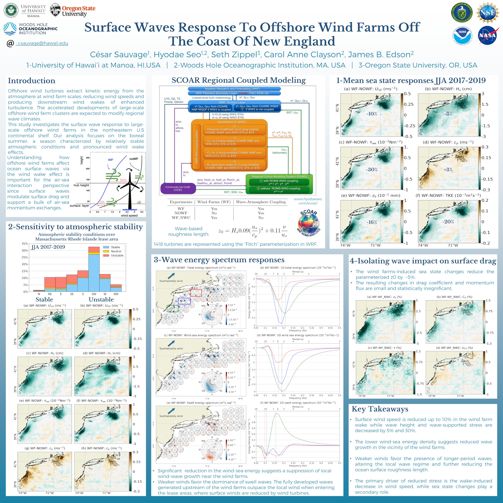
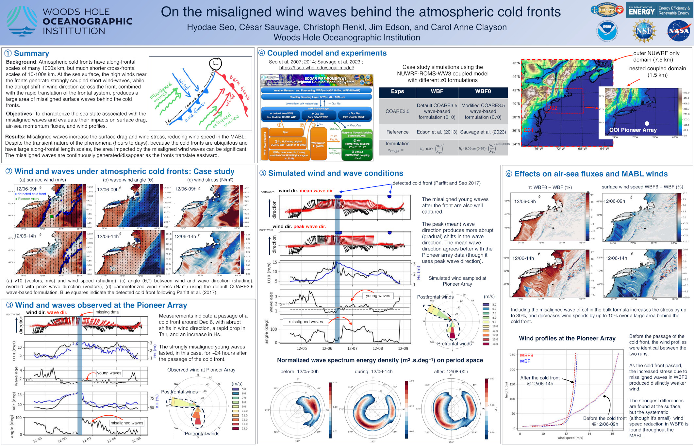

<!-- Here’s a custom image gallery layout: -->

<!--  

  

     <!-- caption="First image" >}} >
  

  

     <!-- caption="First image" >}} >
  

  

     <!-- caption="First image" >}} >
  

 -->

 

  <figure class="flex flex-col items-center">
  
  </figure>
  <figure class="flex flex-col">
  
  </figure>

 

  <figure class="flex flex-col items-center h-full justify-end">
  
  </figure>
  <figure class="flex flex-col items-center h-full justify-end">
  
  </figure>

 

<!--  

  

    
    
---------------------------------

  

  

    
    
---------------------------------

  

  

    
    
---------------------------------

  

  

    
    
----------------------------------

  

 -->

<!-- 

  

    <figure>
      
      <figcaption class="text-center mt-2">Caption for image 1</figcaption>
    </figure>
  

  

    <figure>
      
      <figcaption class="text-center mt-2">Caption for image 2</figcaption>
    </figure>
  

-->

