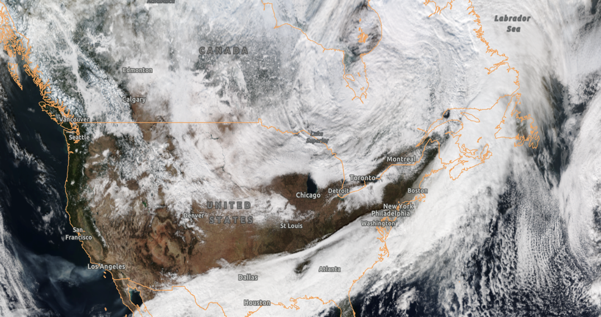
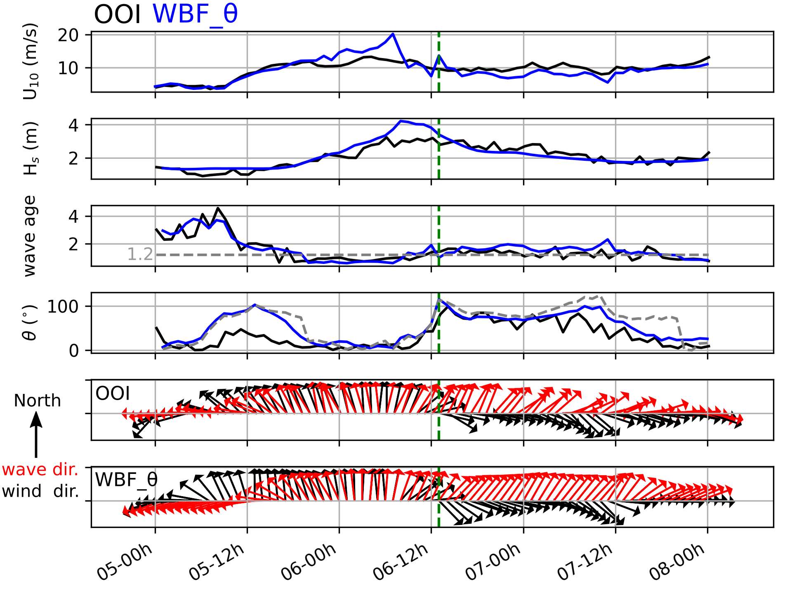
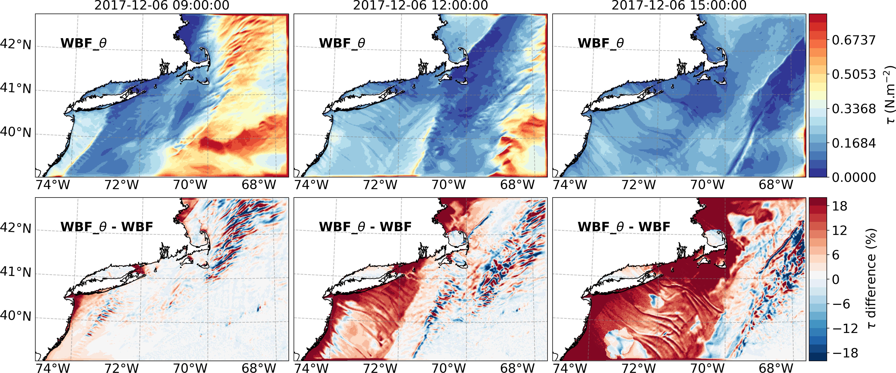

<!--Flexible and powerful data analysis / manipulation library for Python, providing labeled data structures.-->

<!--more-->
Atmospheric cold fronts have elongated along-frontal scales of many 1000s km, but much shorter cross-frontal scales of only 10-100s km. The figures above show an archetypal atmospheric cold front passing over the Northeast of the U.S. on December 6, 2017, at 12:00 pm local time. They are accompanied by gale-force surface winds (15-30 m/s) and mark abrupt shifts in the direction between the pre-frontal and post-frontal winds. At the sea surface, the strong winds generate short-length scale coupled wind-waves of 0.1-10s cm, while the veering of the wind leads to a large area of growing wind-waves that become misaligned with local winds due to the rapid translation of the fronts. These misaligned wind waves behind the cold fronts have yet to be characterized by in situ observations, and the aggregated impacts of the associated sea state on the surface drag and the air-sea momentum fluxes have not been evaluated by numerical models.

The analysis of the observed surface waves and momentum fluxes from the OOI Pioneer Array (Fig1) indicates the abrupt veering of wind direction as the front passes the mooring location, i.e., southerly prior to the front followed by the northerly after the front. On the other hand, the wave direction changes much more slowly since these wind waves in the northward direction are still growing (as indicated by the low wave age, Fig1, Fig2 and Fig3) in response to southerly wind prior to the front passage. This leads to a period of strong misalignment between wind and waves lasting more than 24 hours (Fig1 and Fig3). The analysis of moored observations is complemented by the analysis of two high-resolution ocean-atmosphere-wave coupled model simulations contrasting the run (WBF) with the default wave-based formulation in COARE, which assumes the scalar wave stress to another run (WBF_θ), which increase the roughness length if the waves are significantly misaligned with winds. The simulations show that area of the misaligned waves is significant, commensurate with the along-frontal length scales of many 1000s km behind the front and the time-scales of the frontal passage. The misaligned waves increase the surface drag and air-sea momentum fluxes, in this case, by up to 20% over the large area of the misaligned waves (Fig4).

