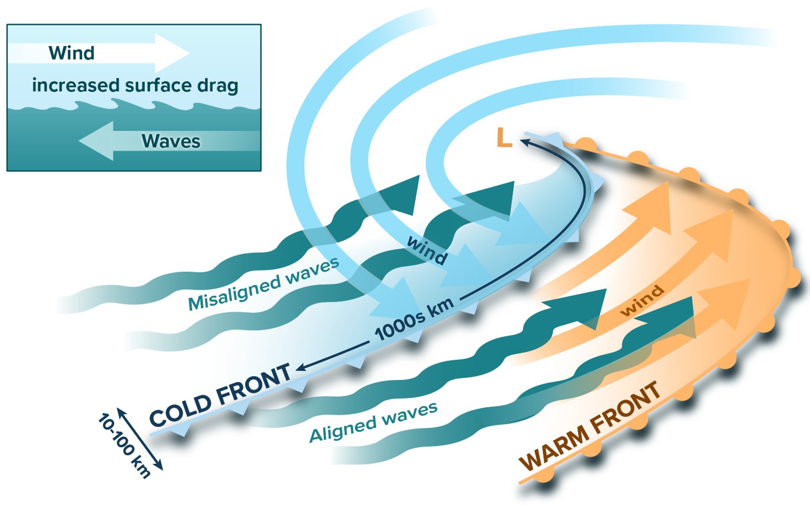
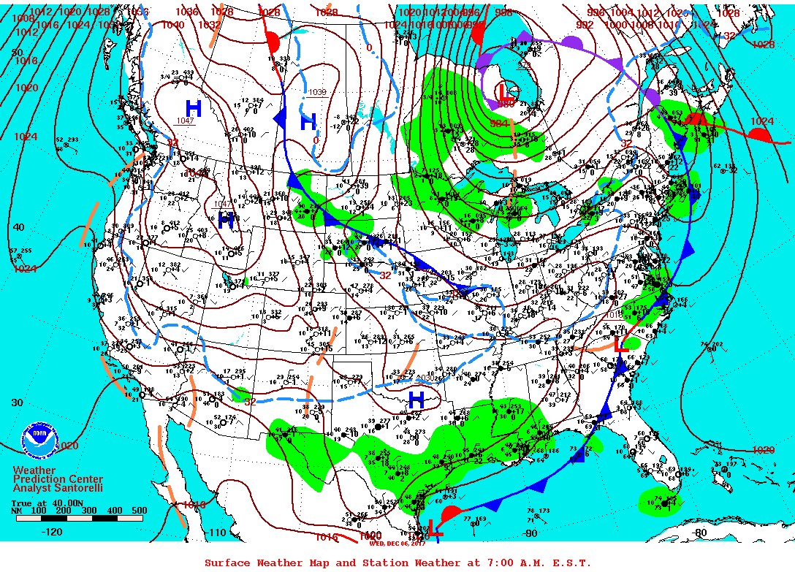
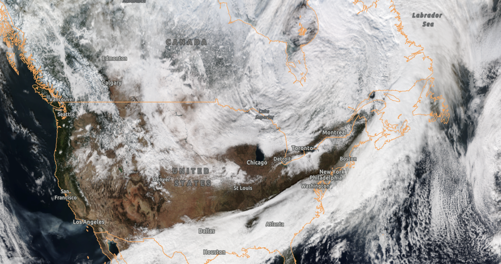
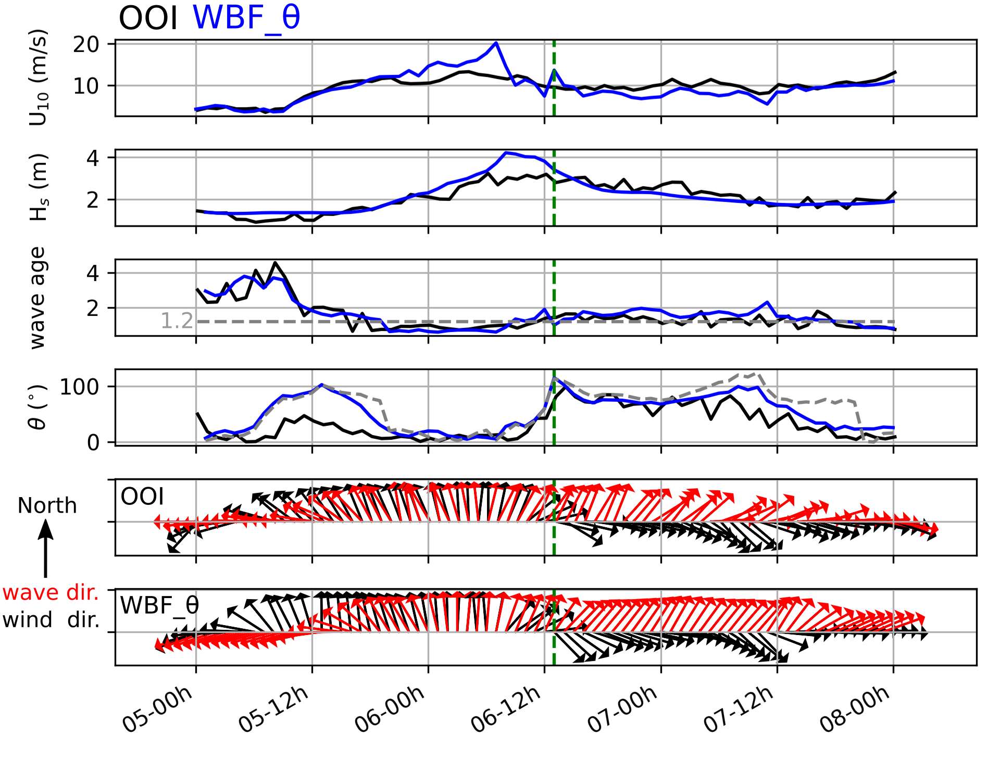
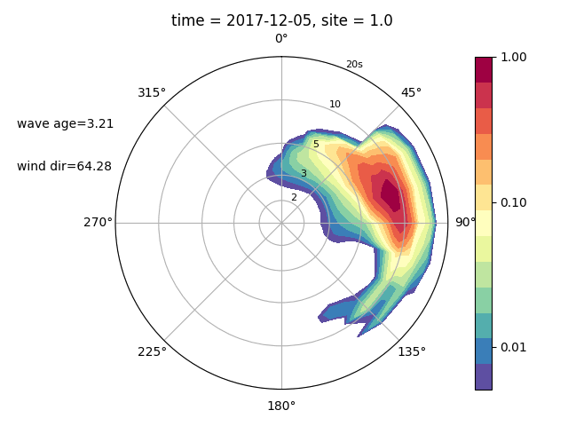
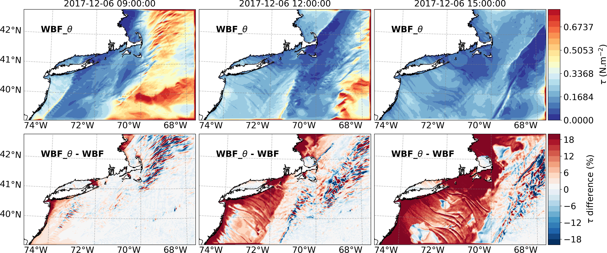

 

Atmospheric cold fronts have elongated along-frontal scales of many 1000s km, but much shorter cross-frontal scales of only 10-100s km. They are accompanied by gale-force surface winds (15-30 m/s) and mark abrupt shifts in the direction between the pre-frontal and post-frontal winds.
 

 
<!--more-->

 
<figure class="flex flex-col items-center h-full justify-end">

<figcaption class="text-center text-sm mt-2">Fig1: A schematic representation of an atmospheric front passing over the ocean showing aligned wind‐waves under the warm sector and strongly misaligned waves behind the cold front. The schematic at the top left represents the mechanism of the enhanced drag behind the cold front when wind and waves are misaligned. The “L” symbol denotes the center of the low‐pressure system..</figcaption>
</figure>
 

 

At the sea surface, the strong winds generate short-length scale coupled wind-waves of 0.1-10s cm, while the veering of the wind leads to a large area of growing wind-waves that become misaligned with local winds due to the rapid translation of the fronts.
These misaligned wind waves behind the cold fronts have yet to be characterized by in situ observations, and the aggregated impacts of the associated sea state on the surface drag and the air-sea momentum fluxes have not been evaluated by numerical models. 

 

The figures below show an archetypal atmospheric cold front passing over the Northeast of the U.S. on December 6, 2017, at 12:00 pm local time.
 

 

  <figure class="flex flex-col items-center h-full justify-end">
  
  <figcaption class="text-center text-sm mt-2">Fig2: --.</figcaption>
  </figure>
  <figure class="flex flex-col items-center h-full justify-end">
  
  <figcaption class="text-center text-sm mt-2">Fig3: --.</figcaption>
  </figure>

 

The analysis of the observed surface waves and momentum fluxes from the OOI Pioneer Array (Fig4) indicates the abrupt veering of wind direction as the front passes the mooring location, i.e., southerly prior to the front followed by the northerly after the front.
On the other hand, the wave direction changes much more slowly since these wind waves in the northward direction are still growing (as indicated by the low wave age, Fig4, Fig5) in response to southerly wind prior to the front passage. 
This leads to a period of strong misalignment between wind and waves lasting more than 24 hours (Fig4). 

 

  <figure class="flex flex-col items-center h-full justify-end">
  
  <figcaption class="text-center text-sm mt-2">Fig4: --.</figcaption>
  </figure>
  <figure class="flex flex-col items-center h-full justify-end">
  
  <figcaption class="text-center text-sm mt-2">Fig5: --.</figcaption>
  </figure>

 

The analysis of moored observations is complemented by the analysis of two high-resolution ocean-atmosphere-wave coupled model simulations contrasting the run (WBF) with the default wave-based formulation in COARE, which assumes the scalar wave stress to another run (WBF_θ), which increase the roughness length if the waves are significantly misaligned with winds.
The simulations show that area of the misaligned waves is significant, commensurate with the along-frontal length scales of many 1000s km behind the front and the time-scales of the frontal passage. The misaligned waves increase the surface drag and air-sea momentum fluxes, in this case, by up to 20% over the large area of the misaligned waves (Fig6). 

 

<figcaption>Fig6: Momentum flux evolution (top) and differences between WBF_θ and WBF (bottom) during the atmospheric cold front passage.</figcaption>

 
 

  <ul class="my_list"> <li><strong>Sauvage, C.</strong>,  Seo, H., Barr, B., Clayson, C-A., Edson, J.B., <em>Misaligned Wind-Waves Behind Atmospheric Cold Fronts.</em> Journal of Geophysical Research: Oceans, DOI: <a class="epub-section__doi__text" href=" https://doi.org/10.1029/2024JC021162">10.1029/2024JC021162</a>, 2024</li></ul>

