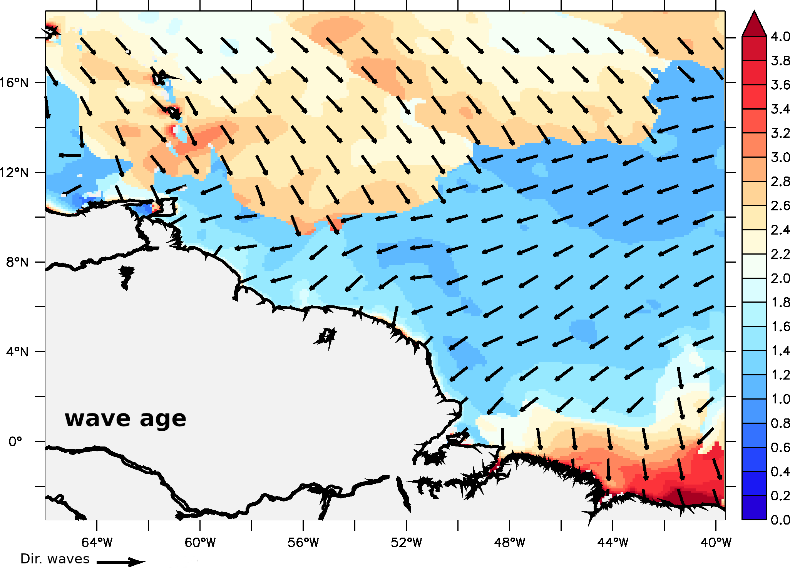
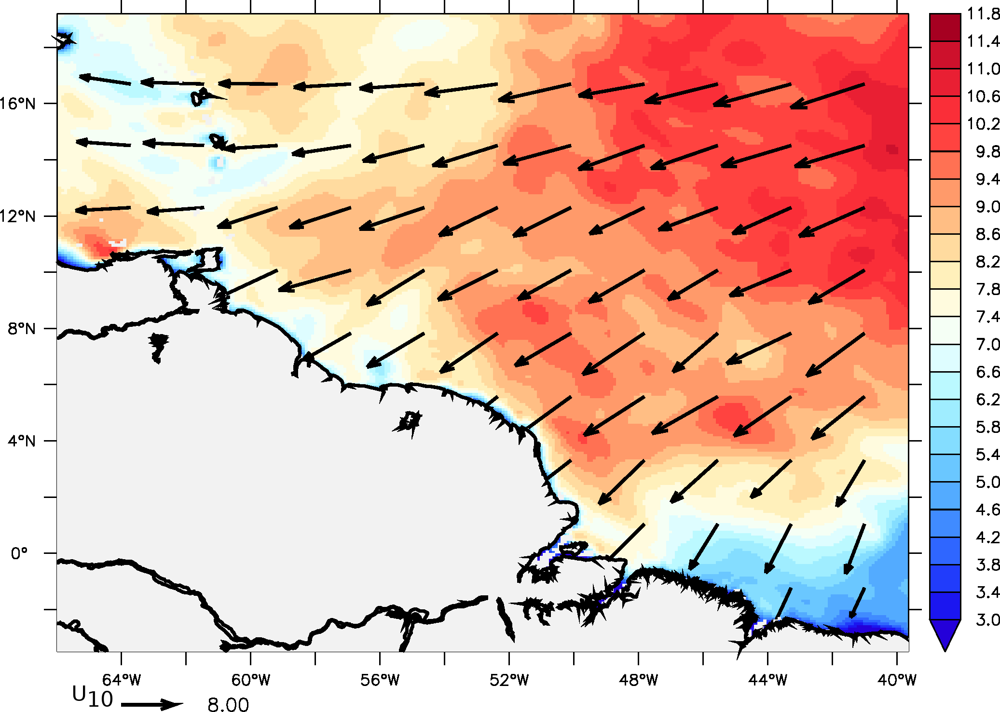
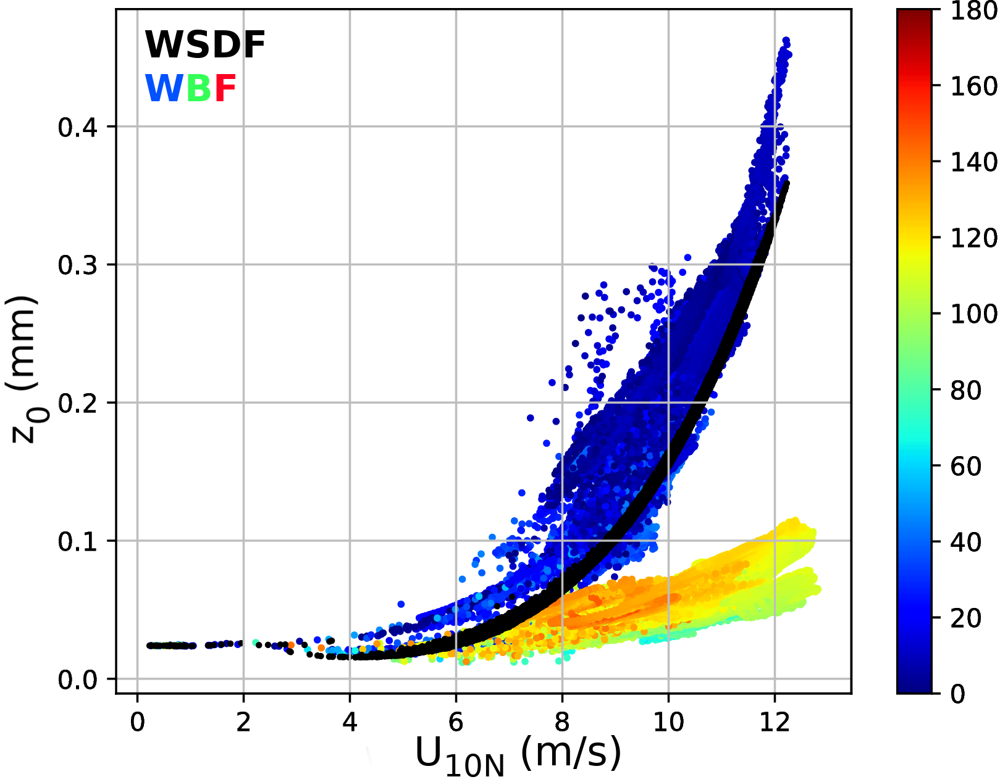
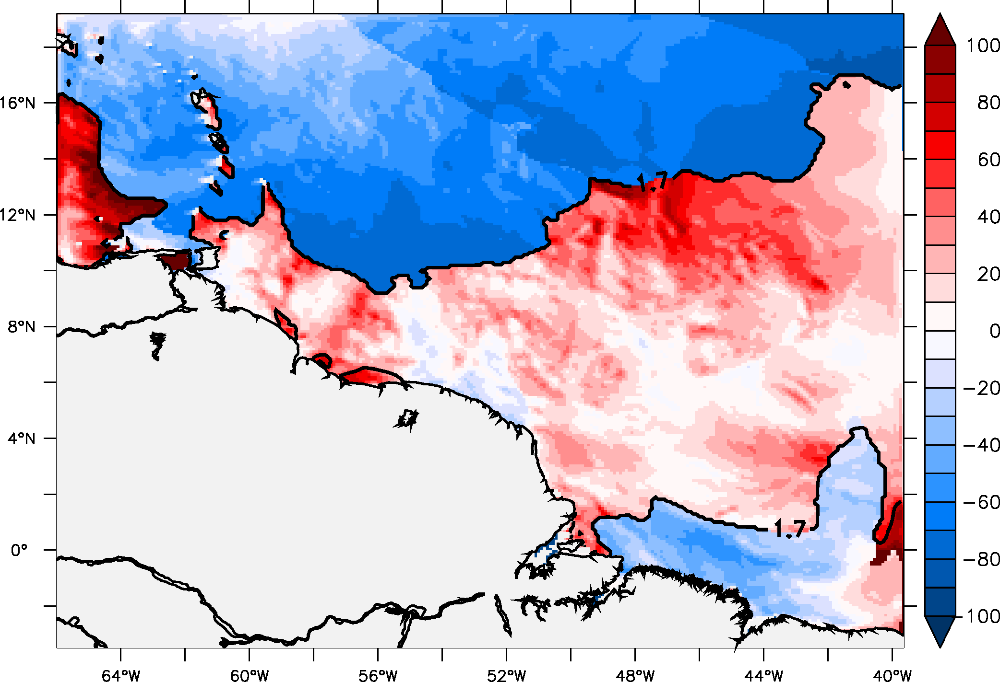
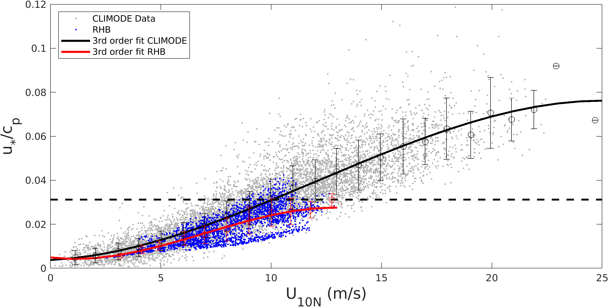
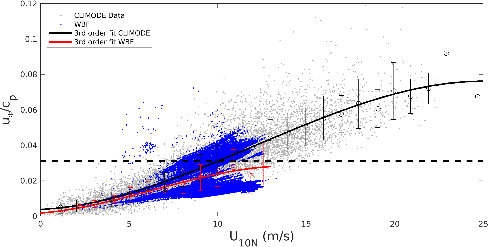

 

  <figure class="flex flex-col items-center h-full justify-end">
  
  <figcaption class="text-center text-sm mt-2">Figure 1: Snapshots of peak wave age (shading) and wave peak direction (arrows) on January 8, 2020 at 0600 UTC.</figcaption>
  </figure>
  <figure class="flex flex-col items-center h-full justify-end">
  
  <figcaption class="text-center text-sm mt-2">Figure 2: Snapshots of 10-m wind speeds (shading, m s−1) and direction (arrows) on January 8, 2020 at 0600 UTC.</figcaption>
  </figure>

 

 
Sauvage et al. (2023) investigate the impact of ocean surface waves on the momentum flux in the mixed sea state where locally-generated short wind-waves coexist with remotely-generated swell. The dominant wave direction in the mixed seas is not generally aligned with the local wind, whose effect on the surface drag is not currently considered in the COARE wave-based formulation for roughness length formulation, where wave stress is assumed to be a scalar quantity. Sensitivity experiments have been conducted using two different wave roughness parameterizations within COARE 3.5, including one that relies solely on wind speed (called wind-speed-dependent formulation, WSDF) and another that uses spatially varying wave age and wave slope (called wave-based formulation, WBF). Results show that, for sea states dominated by short wind waves under moderate to strong winds, the wave-based formulation increases the surface roughness length on average by 25 % compared to the wind-speed-based approach. On the other hand, for the missed sea states where the dominant wave characteristics are uncorrelated with local winds, the wave-based formulation predicts categorically lower roughness length and surface stress (~15 %). Through the surface layer-PBL coupling, the reduced stress over the mixed sea is also translated into the increased near-surface wind speed above the constant flux layer (~5 %). 

   

 

  <figure class="flex flex-col items-center h-full justify-end">
  <a href="scatter_atomic_wind10_znt_wave_nowave_8Jan2020_06h_angle.png" target="_blank">
  
  <figcaption class="text-center text-sm mt-2">Figure 3: Scatter plot of z0 (mm) versus U10N (m/s) from wind-speed-dependent formulation in black and wave-based formulations color-coded to denote the corresponding angle between the wind and wave directions (°) on January 8, 2020 at 0600 UTC.</figcaption>
  </a>
  </figure>
  <figure class="flex flex-col items-center h-full justify-end">
  <a href="znt_diff_wave_nowave_8_jan_6h_percent.png" target="_blank">
  
  
  <figcaption class="text-center text-sm mt-2">Figure 4: A map of percentage difference of z0 between WBF and WSDF on January 8, 2020 at 0600 UTC.</figcaption>
  </a>
  </figure>

 
   
   
 
A further investigation comparing these results with the directly measured momentum fluxes from the R/V Ron Brown during the ATOMIC/EUREC4A experiments indicates that the reduced stress over the mixed sea state is an example of a deficiency in COARE 3.5, where the relevant physics (e.g., misaligned wave effect) is missing, or the inadequate wave parameter is used to describe the mixed sea state (spectral peak vs. spectrally averaged wave parameters). In fact, the COARE3.5’s WBF was developed and tuned primarily by using the wave data collected from the extratropics, where sea state tends to be dominated by growing and fully-developed waves under high winds. Figure 2 compares the sea state used to tune COARE3.5, taken during the CLIMODE campaign (CLIVAR Mode Water Dynamic Experiment), with the sea state observed by RHB during January-February 2020 and modeled in WBF on January 8, 2020 at 0600 UTC in the ATOMIC region. As expected, the sea state captured in the ATOMIC region is very different and much older than the one used in COARE3.5. Therefore, the wind stress under moderate winds and swell dominated conditions observed here, and possibly in other tropical oceans, may not be currently well parameterized in the COARE3.5 WBF. Various approaches are examined to alleviate this potential bias by either introducing directional alignments of wind and waves (WBF_θ) or using spectrally-averaged wave period (WBF_Tm) instead of wave period corresponding to the spectral peak to compute the wave age allowing for a more accurate description of the sea state. 

 

  <figure class="flex flex-col items-center h-full justify-end">
  
  <figcaption class="text-center text-sm mt-2">Figure 5: Scatter plot of inverse peak wave age (u*/cp) versus U10N (m s−1) for CLIMODE data (gray) and Ronald H. Brown (RHB) data (blue). Bin-averages with the 1 standard deviation error bars are overlaid, at 1 m s−1 interval, along with the third order fit (line) for CLIMODE (black) and RHB (red). The horizontal dashed line is u*/cp = 0.03, denoting the threshold for fully developed seas (equivalent to cp/U10N = 1.2).</figcaption>
  </figure>
  <figure class="flex flex-col items-center h-full justify-end">
  
  <figcaption class="text-center text-sm mt-2">Figure 6: As in Figure 5 but RHB data is replaced with wave-based formulations, for the whole domain on 8 January 2020 at 0600 UTC.</figcaption>
  </figure>

 
 

  <ul class="my_list"> <li><strong>Sauvage, C.</strong>, Seo, H., Clayson, C.A. and Edson, J.B., <em>Improving wave-based air-sea momentum flux parameterization in mixed seas.</em> Journal of Geophysical Research: Oceans, DOI: <a class="epub-section__doi__text" href=" https://doi.org/10.1029/2022JC019277">10.1029/2022JC019277</a>, 2023</li></ul>

