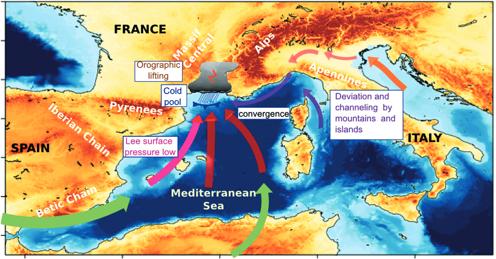
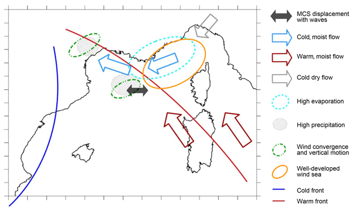
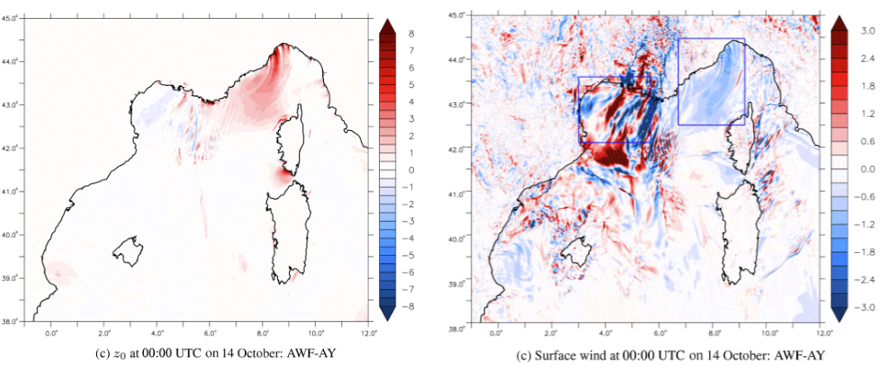

 

  <figure class="flex flex-col items-center h-full justify-end">
  
  <figcaption class="text-center text-sm mt-2">Figure 1: Schematic of the main low-level mechanisms responsible for a sample case of HPE in the western Mediterranean region together with geographical locations. (from Ducrocq et al. 2016)</figcaption>
  </figure>
  <figure class="flex flex-col items-center h-full justify-end">
  
  <figcaption class="text-center text-sm mt-2">Figure 2: Schematic of the main low-level mechanisms occuring during the HPE that happened between the 12 and 14 October 2016 south of France.</figcaption>
  </figure>

 

The western Mediterranean region is regularly affected by heavy precipitation events that are characterized by a large amount of rainfall over a small area in a very short time; these events can lead to flash flooding, causing severe damage and, in some cases, casualties. Mediterranean HPEs are known to be violent events and are quite often associated with strong wind conditions and, thus, a very rough sea state. We investigated the role of the representation of the sea state during the HPE that occurred between the 12 and 14 October 2016 south of France. It led to large amounts of rainfall (up to 300 mm in 24 h) over the Hérault region (southern France). The study case was characterized by a very strong (>20 m s−1) easterly to south-easterly wind at low level that generated very rough seas (significant wave height of up to 6 m) along the French Riviera and the Gulf of Lion 

 

  <figcaption>Figure 3: The sea surface roughness is increased above short waves (left panel) which directly increase the surface stress and decrease the surface wind above (right panel).  </figcaption>

 

In conclusion, the results obtained in this study, even if they only concern one case, mark a new step in our understanding of the sea state impact on Mediterranean HPEs, after the studies of Thévenot et al. (2016) and Bouin et al. (2017), and confirm the following:

 
<ul>
	<li> --> a slowdown of the low-level wind due to higher surface roughness, which increases the momentum flux (even in a moderate-wind context as in the studied case of Thévenot et al., 2016)
	</li>
	<li> --> differences in the low-level dynamics that influence the positioning of the convergence (directly, as in this case, or indirectly as it modifies the propagation of cold pools over the sea, as in Bouin et al., 2017) and, consequently, the location of the heaviest precipitation.
	</li>
</ul>

 
 

<!--

<video width="960" height="720" autoplay controls>
  <source src="/assets/videos/anime_vent_vagues.mp4" type="video/mp4">
</video>

-->

<ul class="my_list">
 	<li><strong>Sauvage, C.</strong>, Lebeaupin Brossier, C., and Bouin, M.-N.: Towards kilometer-scale ocean–atmosphere–wave coupled forecast: a case study on a Mediterranean heavy precipitation event, Atmos. Chem. Phys., 21, 11857–11887, DOI: <a href="https://acp.copernicus.org/articles/21/11857/2021/">10.5194/acp-21-11857-2021</a>, 2021.
 	</li>
 	<li><strong>Sauvage, C.</strong>, Lebeaupin Brossier, C., Bouin, M-N., and Ducrocq, V., <em>Characterization of the air-sea exchanges during a Mediterranean heavy precipitation event using realistic sea state modelling.</em> Atmos. Chem. Phys., 20, 1675–1699, DOI : <a href="https://www.atmos-chem-phys.net/20/1675/2020/">10.5194/acp-20-1675-2020</a>, 2020.
 	</li>
 	<li><strong>Sauvage, C.</strong>,  Lebeaupin Brossier, C., Ducrocq, V., Bouin, M-B., Vincendon, B., Verdecchia, M., Taupier-Letage, I., Orain, F., <em>Impact of the representation of the freshwater river input in the Western Mediterranean Sea.</em> Ocean Modelling, 20, 1675–1699, DOI : <a href="https://www.atmos-chem-phys.net/20/1675/2020/">10.5194/acp-20-1675-2020</a>, 2020.
 	</li>
</ul>

