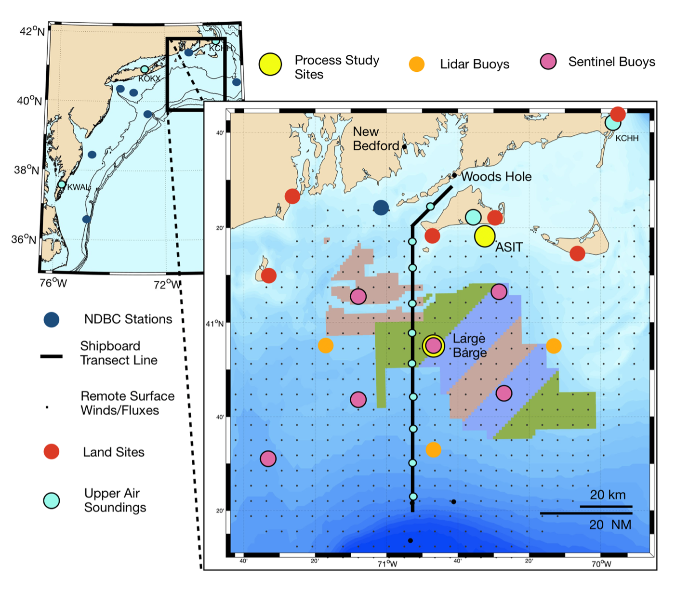
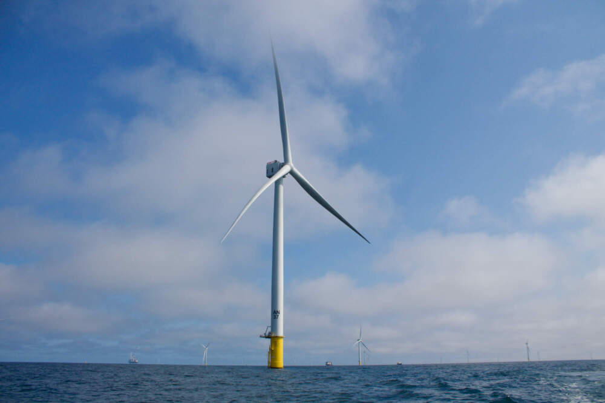
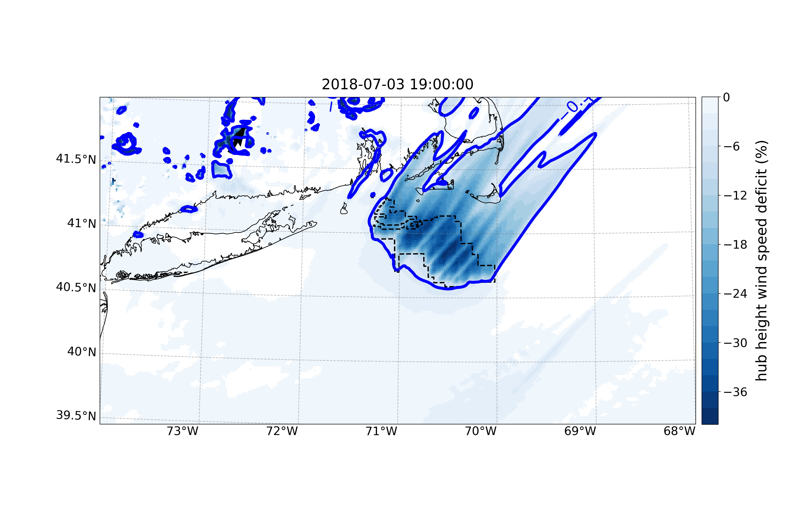

 

The 3rd  <a href="https://www2.whoi.edu/site/wfip3/">Wind Forecast Improvement Project (WFIP3)</a>, sponsored by the U.S. Department of Energy, seeks to improve our understanding of the physics of the atmosphere and ocean that dictate the structure and variability of the wind resource within the Marine Atmospheric Boundary Layer (MABL).

 

  <figure class="flex flex-col items-center h-full justify-end">
  <a href="doe_wfip3_obs.png" target="_blank">
  
  <figcaption class="text-center text-sm mt-2">Fig1: The WFIP3 study region along with the proposed field study assets.</figcaption>
  </a>
  </figure>
  <figure class="flex flex-col items-center h-full justify-end">
  <a href="Vineyard-Wind-1.jpeg" target="_blank">
  
  <figcaption class="text-center text-sm mt-2">Fig2: The Vineyard Wind project south of Martha’s Vineyard, MA.</figcaption>
  </a>
  </figure>

 

 

This 5-year effort, started in the fall of 2021 will carry out a multi-seasonal offshore field measurement campaign in 2024-2025, linked to intensive numerical modeling development and validation efforts. 

 
This work will be carried out by a collaborative team of research institutions, led by the Woods Hole Oceanographic Institution (WHOI), working with the national labs of the Department of Energy (DOE) and the National Oceanic and Atmospheric Administration (NOAA).  The project team receives input from a User Advisory Board composed of a broad coalition of industry partners and ocean stakeholders. 

 

<a href="plot_diff_wind_7067.png" target="_blank">

<figcaption>Wind deficit snapshot.</figcaption>
</a>

